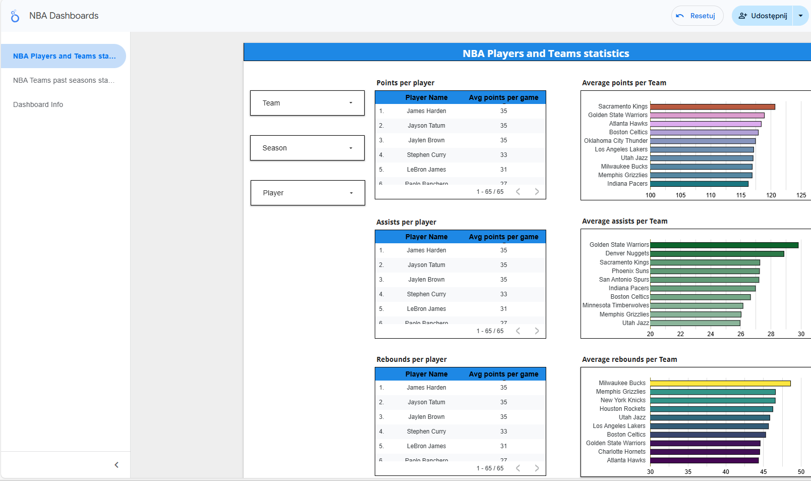

# NBA Analytics Pipeline

**Automated ETL pipeline for NBA statistics using Airflow, dbt, and BigQuery.**  
This project collects, transforms, and analyzes NBA player and team data, stores it in BigQuery, and visualizes insights in Looker dashboards.

---

## Table of Contents
1. [Project Structure](#project-structure)
2. [Requirements](#requirements)
3. [Installation](#installation)
4. [Environment Setup](#environment-setup)
5. [GCP Configuration](#gcp-configuration)
6. [Project Process](#project-process)
7. [Running the Pipeline](#running-the-pipeline)
8. [Looker Dashboard](#looker-dashboard)
9. [License](#license)

---

## Project Structure

```
nba-analytics-pipeline/
├── dags/                  # Airflow DAGs
├── dbt/                   # dbt models, seeds, macros
├── dbt_profiles/          # dbt profile configuration
├── keys/                  # GCP credentials
├── .env                   # environment variables
├── docker-compose.yml     # Docker Compose configuration
├── Dockerfile             # Docker image definition
├── LICENSE                # project license
├── README.md              # project documentation
├── requirements.txt       # Python dependencies
├── dashboard_screen.png   # screenshot of Looker dashboard
└── NBA_Dashboards.pdf     # Looker dashboard export
```

---

## Requirements
- Docker & Docker Compose
- Python 3.10+
- Google Cloud IAM access
- GCP project with BigQuery & GCS enabled
- Looker account with BigQuery connection
- dbt and dbt BigQuery adapter (configure profiles for Europe-west1)

---

## Installation

### 1. Build Docker Image
```bash
docker build -t nba-analytics .
```

### 2. Start Services
```bash
docker-compose up -d
```

### 3. Install Python Dependencies (optional, local dev)
```bash
pip install -r requirements.txt
```

---

## Environment Setup

Create a `.env` file in the root directory with the following variables:

```env
# .env example
GCP_PROJECT_ID=<your-gcp-project-id>
GCS_BUCKET=<your-gcs-bucket-name>
BQ_DATASET=<your-bigquery-dataset-name>
BQ_CREDS_PATH=keys/bq-creds.json
GCS_CREDS_PATH=keys/cred_json_gcp.json
LOCATION=europe-west1
```

**Notes:**
- Use IAM roles in GCP for service account authentication.
- `bq-creds.json` → BigQuery credentials.
- `cred_json_gcp.json` → GCS credentials.

---

## GCP Configuration

1. **Create a GCS Bucket**
```bash
gsutil mb -p $GCP_PROJECT_ID gs://$GCS_BUCKET
```

2. **Create a BigQuery Dataset**
```bash
bq --location=$LOCATION mk --dataset $GCP_PROJECT_ID:$BQ_DATASET
```

3. Ensure your service accounts have **roles/storage.admin** and **roles/bigquery.admin**.

---

## Project Process

The overall process of the project is as follows:

1. **Data Acquisition**
   - Retrieve NBA data from [NBA API](https://www.balldontlie.io/).
   - Run three Airflow DAGs:
     - `nba_etl_pipeline`
     - `dbt_bigquery`
     - `webscraping_prod_virtualenv`

2. **Data Storage**
   - Write raw and transformed data to GCS in Parquet format.
   - Read Parquet files through BigQuery.

3. **dbt Configuration**
   - Configure `profiles.yml` to connect dbt to BigQuery (Europe-west1).
   - Run dbt commands:
     - `dbt seed`
     - `dbt run`
     - `dbt test` (optional)

4. **Analysis & Visualization**
   - Connect Looker to BigQuery.
   - Build dashboards and visualizations.
   - Export dashboard as PDF and screenshot (`NBA_Dashboards.pdf` and `dashboard_screen.png`).

---

## Running the Pipeline

1. Start Airflow DAGs located in the `dags/` folder.

2. Run dbt transformations:
```bash
cd dbt
dbt deps
dbt run --profiles-dir ../dbt_profiles
dbt test --profiles-dir ../dbt_profiles
```

3. Verify data in BigQuery dataset.

---

## Looker Dashboard

- Connect Looker to your BigQuery dataset.
- Build dashboards and visualizations from the transformed NBA data.
- Example dashboard exported as PDF and screenshot:



Refer to `NBA_Dashboards.pdf` for full dashboard report. To quickly check the process, you can also view the pictures in the screenshots directory.

---

## License

This project is licensed under the [GPL-3.0 License](LICENSE).

